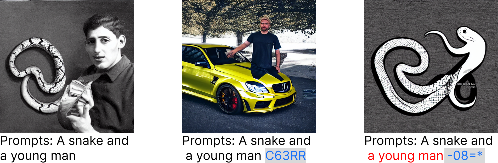

# QF-Attack
This is an official implementation of our paper [CVPR Workshop'23] [A Pilot Study of Query-Free Adversarial Attack against Stable Diffusion](https://arxiv.org/abs/2303.16378).

Despite the record-breaking performance in Text-to-Image (T2I) generation by Stable Diffusion, less research attention is paid to its adversarial robustness. In this work, we study the problem of adversarial attack generation for Stable Diffusion and ask if an adversarial text prompt can be obtained even in the absence of end-to-end model queries. We call the resulting problem 'query-free attack generation'. To resolve this problem, we show that the vulnerability of T2I models is rooted in the lack of robustness of text encoders, e.g., the CLIP text encoder used for attacking Stable Diffusion. Based on such insight, we propose both untargeted and targeted query-free attacks, where the former is built on the most influential dimensions in the text embedding space, which we call steerable key dimensions. By leveraging the proposed attacks, we empirically show that only a five-character perturbation to the text prompt is able to cause the significant content shift of synthesized images using Stable Diffusion. Moreover, we show that the proposed target attack can precisely steer the diffusion model to scrub the targeted image content without causing much change in untargeted image content.

## Dependencies
- PyTorch => 1.13.03
- transformers >= 4.23.1
- diffusers >= 0.11.1
